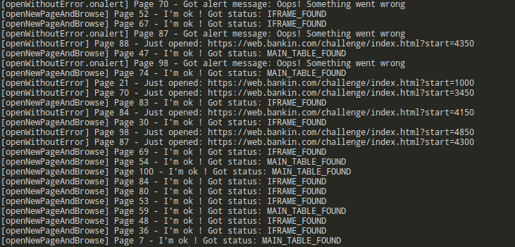
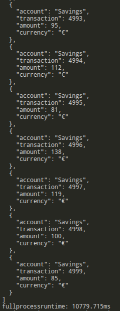

# Bankin’ Challenge Engineering #1 — Web Scraping script explained
Here are the detailed steps involved for getting the scraping script up and running. Next to be coming is a detailed tutorial describing the main steps involved in the Bankin’ Web Scraping Challenge script development (to be continued...). 

This tutorial assumes you are already familiar with Nodejs and npm usages.

Script by Xavier Prud'homme - [Linkedin profile](https://www.linkedin.com/in/xavierprudhomme/)

Scraping challenge rules [here](https://blog.bankin.com/challenge-engineering-web-scrapping-dc5839543117)

**Here is the link to the detailed tutorial article (to be continued): [Medium Article](https://medium.com/@xavier_93068/d6988d207a7)**

## Immediate usage
In order to test the scraping script right now, simply follow the instructions below:

**Requirements: make sure Nodejs v8.x is properly installed on your system beforehand.**

First, open a new console and clone this repository to a desired location:

    $ cd /tmp
    $ git clone https://github.com/xprudhomme/bankin-webscraping-challenge & cd bankin-webscraping-challenge

Then, install the node modules dependencies:

    $ npm i
    
Eventually, simply run the node script:
 
    $ node bankin-challenge-scraping.js
    
By default, the script opens up to 100 pages at a time, but you could configure it to handle more if you wanted:

    $ node bankin-challenge-scraping.js --pages=200

## Some preliminary explanation 

The reason behind the default 100 pages processes in parallel choice is very specific and scraping-oriented. 

When dealing with any website scraping scenario, one should always first deeply analyse the site, and then ask himself a couple of questions: 
- how many pages of data will my scraping bot have to handle?
- depending on the previous answer, should I request all the pages at the same time, or
- should I split the main process into several subprocesses, each responsible for a smaller amount of pages at a time?

If there are more than a couple of hundred of pages to crawl, obviously we don't want to send 100xN requests at a time, we must respect some form of courtesy and politeness towards the targetted site. 

For example, if we were to extract data from a website having more than a thousand pages, we could easily break down the main process in a loop of 100 occurences, each responsible for sending 10 requests at a time.

But here, in our case for this challenge, the site has a maximum records count of 5 000 (4 999 exactly), with 50 records per page, meaning there is a maximum of 100 pages to be done. Since the challenge rules tells us they want the fastest script possible, let's deal with these 100 pages in one and only one batch: 100 pages at a time. If there were 10K records, we could still run the script with --pages=200, assuming your local machine/server can handle it (enough RAM).

## Results
**Important note: for some reason, the very first time Puppeteer launches a Chromium instance, right after we have installed it with npm i puppeteer, it takes age to load. Not sure if this is somehow related to node modules caching.**

Once the script is launched, the first things you notice are a whole bunch of logs displayed in the console. By default, the script handles 100 pages processes in parallel, and each of them display log messages in the console, allowing us to keep an eye on what's going on.

There is nothing to worry about, that's totally normal. The script actually tells us which page has been processed, which one has failed and been retried until being loaded correctly. 

We can easily distinguish between three page situations:
 - No error, the data table is an HTML table located in the page html body
 - No error, the data table is an HTML table located in an iframe
 - An error occured: an alert message is displayed, it is dimissed and the page is reloaded

When all pages have been successfully loaded, the tables data is displayed in the console, and logged/saved into a local file located in the output folder. 

**The JSON output file is named after the following convention: output/allrecords_{currenttimestamp}.json**

Eventually, the full process runtime is displayed. 

**It usually takes approximately 7-14 seconds to run upon completion (with currently 100 pages proccessed at a same time).**

## Tools/weapon choice

One of the challenge rule was to pick our scraping weapon among the following: NodeJS, CasperJS, PhantomJS, Chrome Headless, Firefox Headless, Selenium

The choice was easy: I set my sights on Chrome Headless + Nodejs + the [Puppeteer node library](https://github.com/GoogleChrome/puppeteer). 

### 1. Chrome Headless

This choice main reason being simple to understand: Since the official announcement of Chrome Headless, many of the industry standard libraries for automated testing have been discontinued by their maintainers. Including PhantomJS. Selenium IDE for Firefox has been [discontinued](https://seleniumhq.wordpress.com/2017/08/09/firefox-55-and-selenium-ide/) due to lack of maintainers. I’ve been personally using PhantomJS along with CasperJS / SlimerJS for a while, and I can affirm those were not as stables as Chrome Headless which better handles memory management and CPU usage.

### 2. Node + Puppeteer

The Chrome Headless choice was also highly motivated because of the existence of Puppeteer. Puppeteer is a Node library maintained by the Google Chrome DevTools team. It provides a high-level API to control [headless](https://developers.google.com/web/updates/2017/04/headless-chrome) Chrome or Chromium over the [DevTools Protocol](https://chromedevtools.github.io/devtools-protocol/). It can also be configured to use full (non-headless) Chrome or Chromium. 

# Script tutorial

## Let’s get it started !

Before we start, we need Node + npm and the Puppeteer lib installed. For Node and npm, head over to their website and install them:

[Node 8.+](https://nodejs.org/)

### Project setup

Assuming we are using a Unix-like OS, let’s start off by creating the project directory

    mkdir bankin-challenge && cd bankin-challenge/

Now, time to initialize our Node project. Fill in the necessary details when asked to.

    $ npm init

Install Puppeteer as a Node module, adding its dependency to our package.json

    $ npm i --save puppeteer

Note: If you want to benefit from the latest features and bug fixes, you can clone and install it directly from its [GitHub repository](https://github.com/GoogleChrome/puppeteer).

Puppeteer includes its own Chromium browser, so it’s not necessary to setup a standalone Chrome/Chromium browser instance on your machine. But you could if you really wanted to : )

## Coding

Here we go. First of all, we have to initialize and launch a fresh Chrome instance:

…to be continued:

